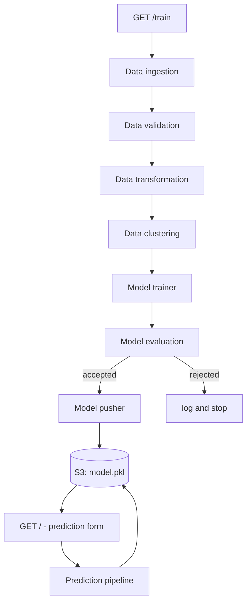
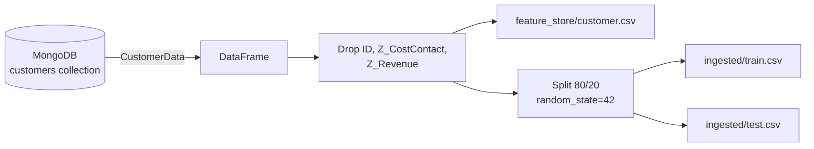
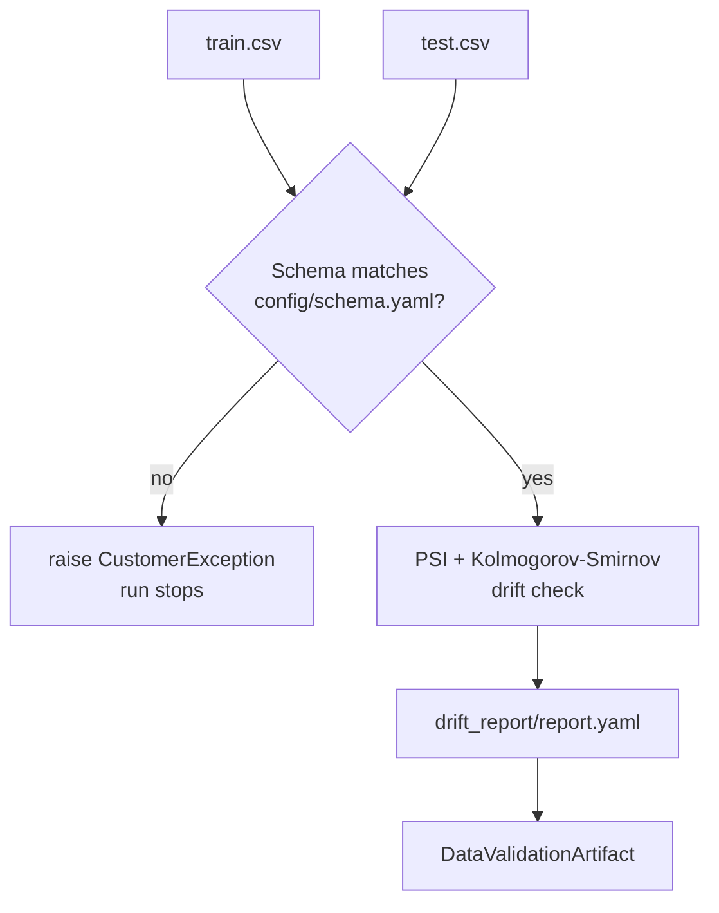
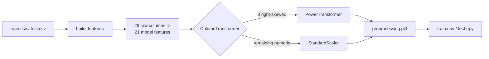
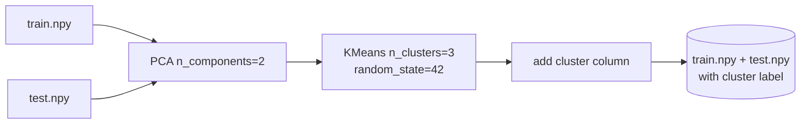
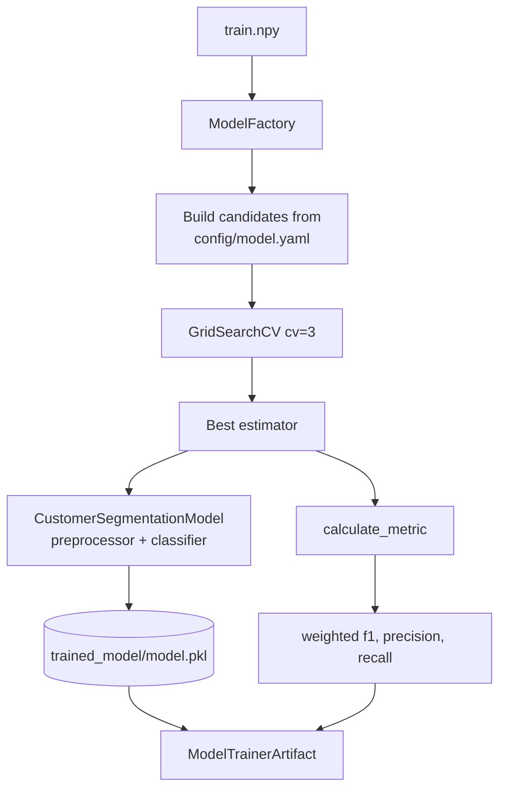
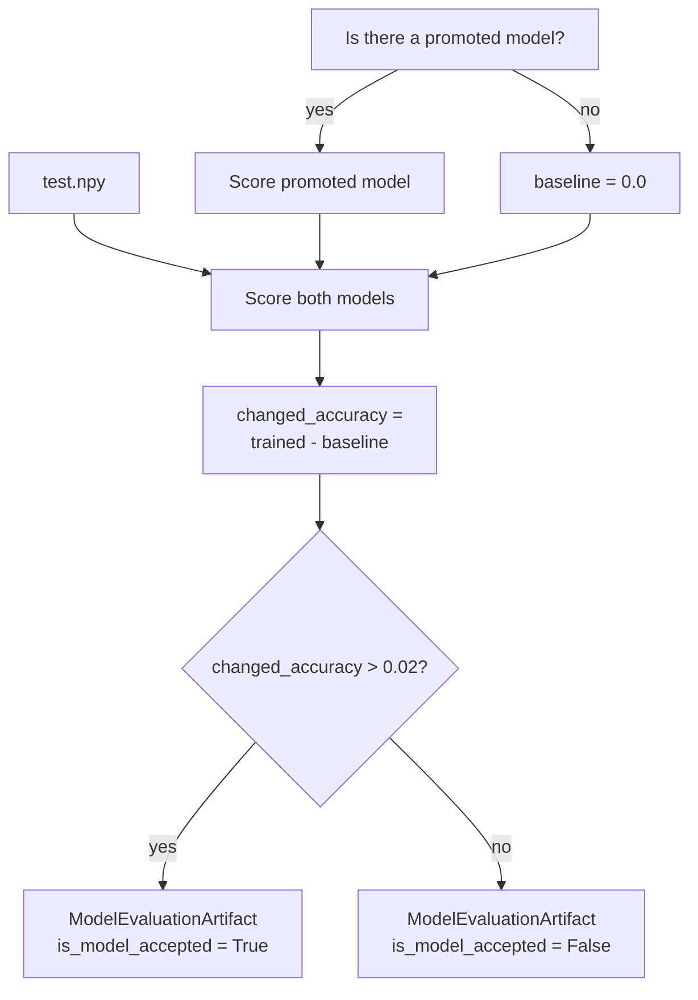
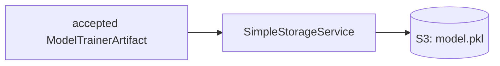
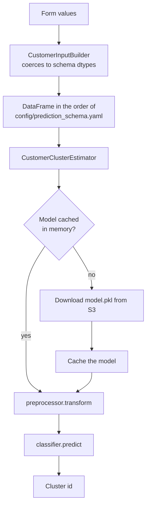
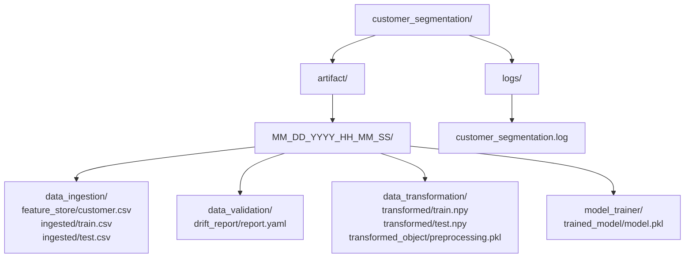

# Architecture

The project is a two-pipeline ML service: a **training pipeline** that runs on
demand and promotes a model to object storage, and a **prediction pipeline**
that serves the promoted model.

Stage-by-stage diagrams are below. Every file and directory name matches what
the pipeline actually writes under
`customer_segmentation/artifact/<MM_DD_YYYY_HH_MM_SS>/`.

## End to end

## 1. Data ingestion

`src/components/data_ingestion.py`

Reads the collection through `CustomerData`, drops the three columns listed in
`config/schema.yaml` under `drop_columns`, and writes a deterministic split. The
unsplit frame is kept as `feature_store/customer.csv` so a run can be inspected
after the fact.

## 2. Data validation

`src/components/data_validation.py`

A schema mismatch fails the run. Drift is advisory: it is measured, written to
`report.yaml` and logged as a warning, because a random split of a homogeneous
population is expected to trip the statistical test from time to time.

## 3. Data transformation

`src/components/data_transformation.py`

`build_features()` derives `Age`, `Total_Spending`, `Days_as_Customer`,
`Parental Status` and one column per spend category, then drops the raw columns
it consumed. The fitted `ColumnTransformer` is saved as `preprocessing.pkl` and
travels with the model, so inference needs no separate preprocessing step.

## 4. Data clustering

`src/components/data_clustering.py`

PCA compresses the 21 features to 2 components for grouping. The resulting
cluster id becomes the supervised target, which is what bridges the
unsupervised and supervised halves of the project.

## 5. Model trainer

`src/components/model_trainer.py`

The model file is self-contained: it bundles the fitted preprocessor with the
classifier, so a single pickle can score a raw customer record.

## 6. Model evaluation

`src/components/model_evaluation.py`

Both models are scored on the already-transformed test matrix, so the
preprocessor bundled in each pickle is deliberately bypassed - scoring the raw
estimator keeps the comparison honest. The first run has no incumbent, so
anything above zero counts as an improvement.

## 7. Model pusher

`src/components/model_pusher.py`

Uploads the model to the bucket configured by `TRAINING_BUCKET_NAME`. A
regression is never written, so the promoted model can only improve.

## Prediction pipeline

`src/pipeline/prediction_pipeline.py`

The model is downloaded once per process and then cached, so repeated
predictions do not hit S3 every time. The input frame is built in the exact
order of `config/prediction_schema.yaml`, which is the contract the classifier
was trained against.

## Artefact layout

Nothing is written inside `src/`.
